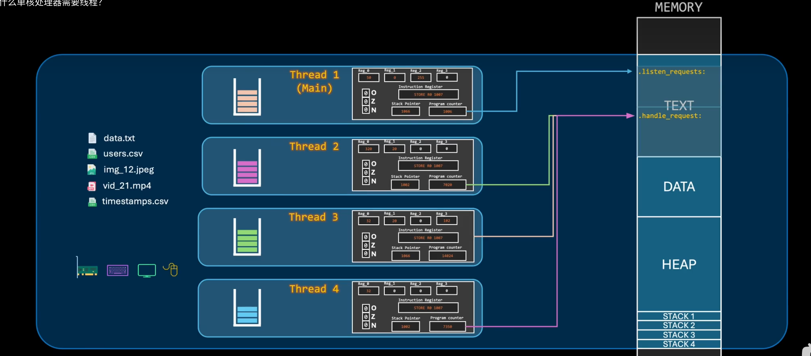

# Thread
> 先学习: [为什么单核处理器需要线程？](../../010.LESSONS/27156221473-1-192.mp4)

+ 线程拥有独立的程序计数器，那么就必须得有独立的寄存器组、标志等，即 独立的CPU状态
+ 线程共享所属进程的整个地址空间代码段:TEXT是共享的，所有的线程都通过独有的程序计数器来指向正在执行的代码 ， 但每个线程拥有独立的栈指针。
  - 
+ 进程地址空间的划分