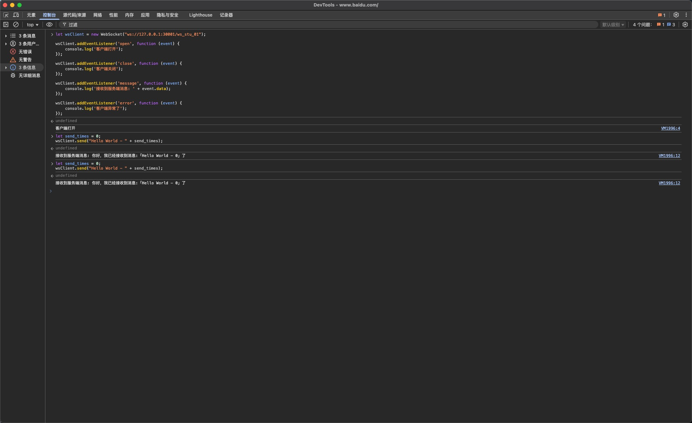

# 在Google-Chrome下调试WebSocket
```javascript
let wsClient = new WebSocket("ws://127.0.0.1:30001/ws_stu_01");

wsClient.addEventListener('open', function (event) {
    console.log('客户端打开');
});

wsClient.addEventListener('close', function (event) {
    console.log('客户端关闭');
});

wsClient.addEventListener('message', function (event) {
    console.log('接收到服务端消息: ' + event.data);
});

wsClient.addEventListener('error', function (event) {
    console.log('客户端异常了');
});

let send_times = 0;
wsClient.send("Hello World - " + send_times);
```

## 示例



## 参考资料
1. [https://developer.mozilla.org/en-US/docs/Web/API/WebSocket](https://developer.mozilla.org/en-US/docs/Web/API/WebSocket) 对应仓库: [https://github.com/mdn/content](https://github.com/mdn/content)