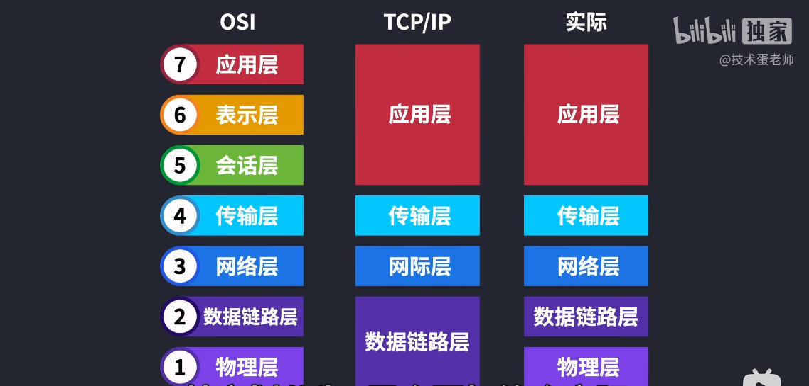
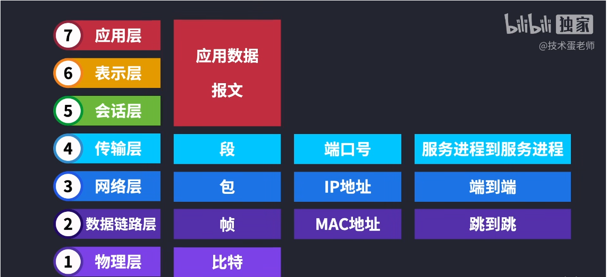
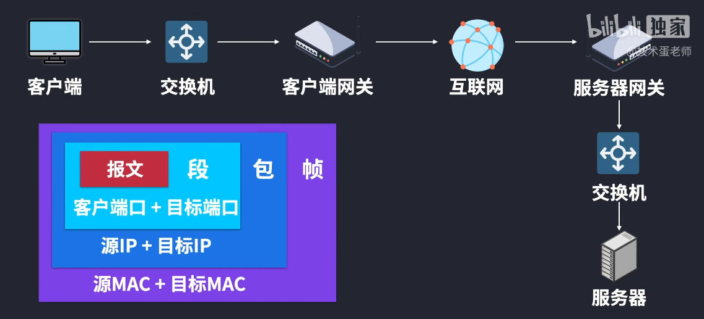

# OSI 七层网络参考模型 & 五层
> 请先学习:[互联网数据传输原理 ｜OSI七层网络参考模型](../../010.LESSONS/786880370_u1-1-208.mp4)

---
## 注意事项
+ OSI 中的MAC地址，是谁的MAC地址?

---

## 模型分层：7层七层只是参考模型，实际上并不适用，只是用来分析和排查问题;实际使用:5层; 
- 传输层: 只做这一件事情: 建立端(客户端/服务端)到端的连接,

---

## 数据流通过程 

 - 各个层传输的内容段、包、帧、比特和传播方式端口号、IP地址、Mac地址也不一样

### 请求流程&响应流程

  - 每个层的传输方式是什么？每个层会对上层的数据做什么处理
  - 这里的MAC地址，并不是端的MAC地址，而是下一跳的源MAC地址和目的MAC地址。下一跳: 数据链路层概念，见:[互联网数据传输原理 ｜OSI七层网络参考模型](../../010.LESSONS/786880370_u1-1-208.mp4) 

---
## IP 地址如何解析为MAC地址
+ ARP协议: ARP（Address Resolution Protocol，地址解析协议）是用来将IP地址解析为MAC地址的协议。

## 参考资料
+ [什么是ARP？](https://info.support.huawei.com/info-finder/encyclopedia/zh/ARP.html)
  - [什么是ARP?.pdf](../005.REFS/什么是ARP？它是如何进行地址解析的？%20-%20华为.pdf)
+ [第二十六章 IP与MAC一线牵之ARP](https://forum.huawei.com/enterprise/cn/zh/thread/blog/580887527756283904?blogId=580887527756283904)
   - [【交换机在江湖】第二十六章+IP与MAC一线牵之ARP.docx](./../005.REFS/【交换机在江湖】第二十六章+IP与MAC一线牵之ARP.docx)
   - [【交换机在江湖】第二十六章+IP与MAC一线牵之ARP 网页HTML](../005.REFS/%20IP与MAC一线牵之ARP/【交换机在江湖】第二十六章%20IP与MAC一线牵之ARP.html)
