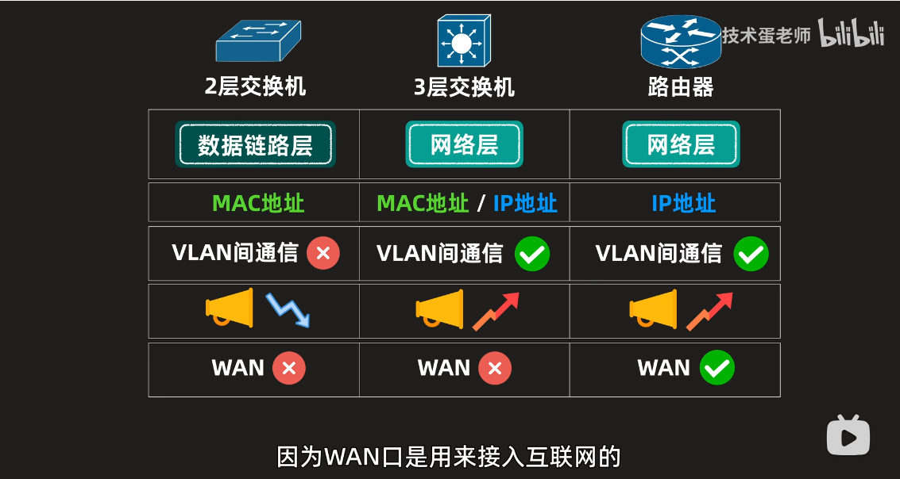

# 交换机的核心工作原理
> 先学习:[交换机的核心工作原理 | 集线器、2层交换机和3层交换机的主要区别](../../010.LESSONS/1635452789-1-16.mp4)

+ WAN 口是用于接入互联网的

## 集线器工作模式
+ 集线器会将数据帧发送给所有的计算机，集线器不看你的数据帧里有什么，每次收到后，直接复制给所有设备，所有设备在收到数据帧后，会检查帧里的目标地址是否为自己的MAC地址，若是给自己的，那就处理；不是给自己的，就直接丢弃。

+ 集线器引发的问题： 设备都被迫接收你的数据帧，增加了设备的工作量；集线器不能同时发送和接收数据，一次只能允许一台设备发送数据，多个设备同时发送数据帧，同一时刻只有一个能发送出去，其他丢弃。—— 所以，需要交换机

## 交换机工作模式
交换机中存在一张 `MAC地址表` , MAC地址表初始为空，在发送数据帧的过程中会逐步记录MAC地址和端口`交换机的端口`号。

MAC地址表填充: ARP协议引用，设备会将目标MAC地址设置为广播MAC地址: FF:FF:FF:FF:FF:FF 发送设备不知道目标设备的MAC地址, 将目标地址设置为广播地址，数据帧发送到交换机后，交换机将数据帧发送给所有设备交换机MAC地址表没有当前MAC地址——交换机的泛洪模式 ， 设备们收到数据帧后会检查目标地址是否为自己的IP地址，若不是，则丢弃请求；若是，则进行响应，响应里面就有MAC地址，此时响应数据帧会经过交换机，此时交换机会记录端口号`交换机的端口`号和MAC地址,下一次发送就不需要广而告之，直接进入转发，避免浪费大家资源。发送设备也就知道了目标的MAC地址了，不用再次设置为广播MAC地址了。
- 这里的MAC地址，指的是 `下一跳的MAC地址` , 见:[003.OSI七层网络模型# MAC地址是下一跳的MAC地址](../003.OSI七层网络模型/README.md)

## 为什么需要VLAN
学习 [交换机工作模式](#交换机工作模式)后，假设多台设备发送的数据帧都是广播地址，交换机就不得不都进行泛洪模式，会影响网络，浪费设备算力，降低安全性，此时可以通过VLAN将不同的设备划分为不同的虚拟局域网，不同VLAN中发送的数据，其他VLAN看不到，即： 将原本较大的广播范围降低为较小的广播区间，

## 三层交换机工作模式: 既可以转发(处理MAC地址)，也可以路由(处理IP)