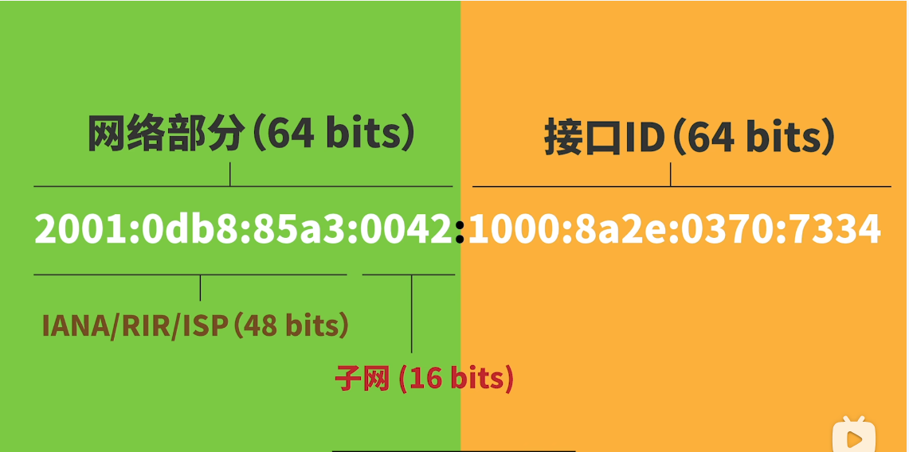
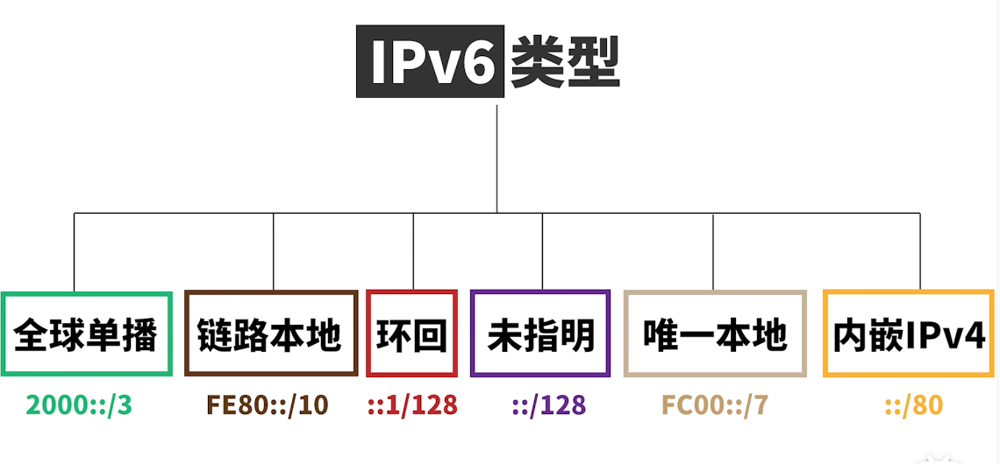
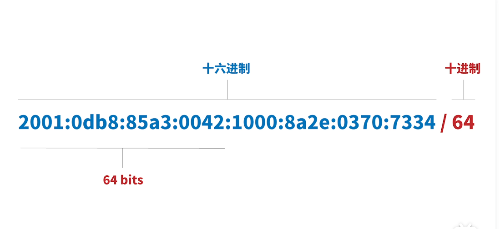

# IPv4-IPv6区别
> 学习: 

IPv6由128位二进制组成，采用十六进制表示，分为八个部分: 128 / 4(采用十六进制表示) = 32 / 4 (每个部分由4位16进制数表示)

## 地址划分
+ IPv6分为 网络部分 + 接口ID , IPv6没有子网掩码，因为地址足够使用
  - 

## IPv6类型
+ 
  - 全球单播地址: 公网IP
  - 链路本地地址： 用于单个链路上寻址，路由器不转发，Ping不了
  - 未指名地址： 全0地址，类似于IPv4的 0.0.0.0
  - 唯一本地地址： 私有IP地址

+ 
   - 64 位`前缀`指示的是网络部分，