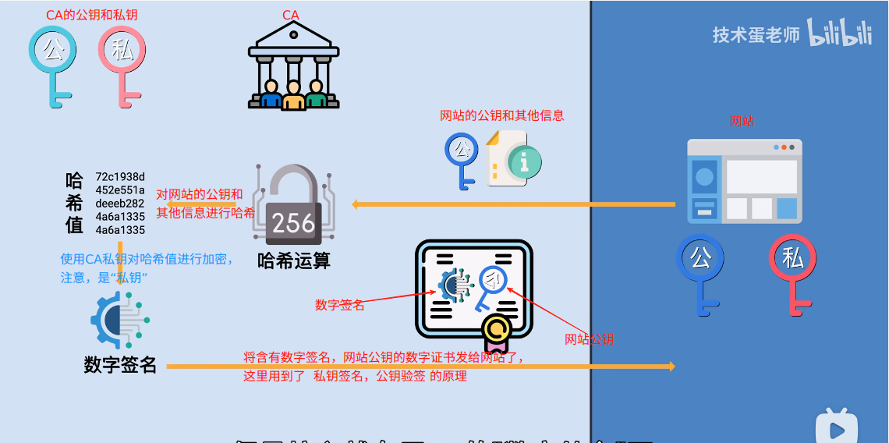
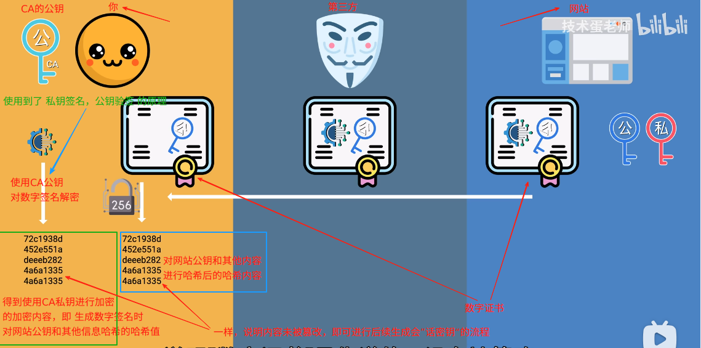
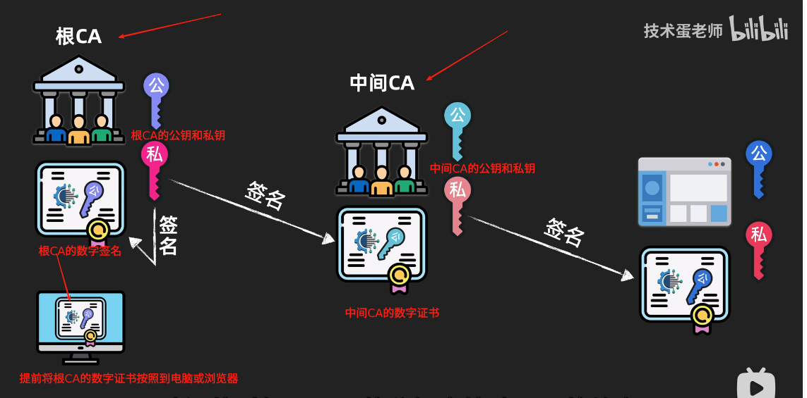

# 数字签名和数字证书
> 请先学习:[数字签名和CA数字证书的核心原理和作用](../../../010.LESSONS/1470290022-1-16.mp4)

## 对称加密 & 非对称加密
> 学习:[什么是非对称加密？_对比非对称与对称加密 _ Cloudflare](./999.REFS/什么是非对称加密？_对比非对称与对称加密%20_%20Cloudflare.pdf)


### 对称加密
双方只用同一把私钥进行加密解密的加密方式就是对称加密

### 非对称加密
```txt

 1. 公钥加密，私钥解密
      公钥加密，只有拥有对应私钥的人才能解密，所以可以用来加密信息

 2. 私钥加密，公钥解密 —— 数字证书
      即: 私钥签名，公钥验签 (私钥加密，谁都可以解密,只有正确的公钥才能解析出正确的内容，用来验证身份)

```

## 无 Https 缺点
+ 机密性
   ```txt
       网络数据包会被抓取，信息会被泄露
   ```


+ 无法保证数据的完整性: 信息可能被修改
  ```txt
     即： 你和对方中间存在个第三方，你并不是直接和第三方进行会话，而是被第三方拦截，通过第三方间接和对方会话。
   
   问题：
     1. 无法确定公钥是网站的还是中间人的: 那就需要 数字证书了
  ```

+ 身份验证
  ```txt
     没有使用https，很难证明你访问的是官网
     > [证书验证](如何判断域名和证书绑定)
  ```

---

## 会话密钥
> 学习:[什么是会话密钥？_会话密钥和TLS握手 _ Cloudflare.pdf](./999.REFS/什么是会话密钥？_会话密钥和TLS握手%20_%20Cloudflare.pdf)、[TLS 握手期间会发生什么？_ SSL 握手 _ Cloudflare.pdf](./999.REFS/TLS%20握手期间会发生什么？_%20SSL%20握手%20_%20Cloudflare.pdf) 


会话密钥是用于仅对单次通信会话进行加密的任何对称加密密钥。换句话说，它是一个临时密钥，只使用一次，仅在一个时间段内用于加密和解密双方之间发送的数据；双方之间的未来对话将使用不同的会话密钥进行加密。会话密钥就像每次登录时都会重置的密码一样。

在 TLS（过去称为“SSL”） 中，两个通信方（客户端和服务器）在任何通信会话最开始的 TLS 握手期间生成会话密钥

### 原理
+ 先进行密钥的交换，再用对称加密的方式进行加密通信。

---

## 数字证书
需要第三方机构<sup>证书颁发机构: Certificate Authority</sup>来解决`公钥`的信任问题 ， 公钥会被放在被信任的第三方CA那里，CA 根据这个公钥和其他信息生成了`数字证书` , 数字证书 让公钥和这个网站绑定起来了。

网站在与你进行加密协商之前，会提前将数字证书发给你，当识别后发现数字证书是由信任的CA颁发<sup>验证流程:[数字签名校验流程](#数字签名校验流程)</sup>的，于是从数字证书中提取出`公钥`，那么就可以生成会话密钥了。

#### 数字证书使用流程
##### 数字证书颁发流程


##### 数字证书的使用流程



## 数字签名 <sup>校验数字证书的权威</sup>
如何确定`数字证书`是由信任的CA颁发的呢? 通过数字证书上的签名
#### 数字签名校验流程
> 参考: [数字证书的使用流程](#数字证书的使用流程)


---
## 证书链 <sup>获取CA的 公钥</sup>
> CA 也需要 “数字证书” 来确定自己的身份

### 核心
+ 使用顶层的私钥给下层的证书签名
+ 验证时使用顶层的公钥验证下层的数字证书的合法性



---
## 证书校验
个人(浏览器) 获取到网站数字证书后，获取获取到证书的颁发者，浏览器获取到整个证书链，最终会找到根数字证书，并提取根证书里面的公钥验证中间证书的签名，没问题再用中间证书的公钥来验证网站证书的签名，都没问题说明网站的证书没有被篡改，但是没有被篡改也没有办法说明该证书就是该网站的，浏览器还会查看“主题背景”的公用名和域名是否一致，一致，说明这份证书是和该域名绑定的。


---

## 参考资料
+ [什么是非对称加密: https://www.cloudflare-cn.com/learning/ssl/what-is-asymmetric-encryption/](https://www.cloudflare-cn.com/learning/ssl/what-is-asymmetric-encryption/)
+ [TLS 握手期间会发生什么？: https://www.cloudflare-cn.com/learning/ssl/what-happens-in-a-tls-handshake/](https://www.cloudflare-cn.com/learning/ssl/what-happens-in-a-tls-handshake/)