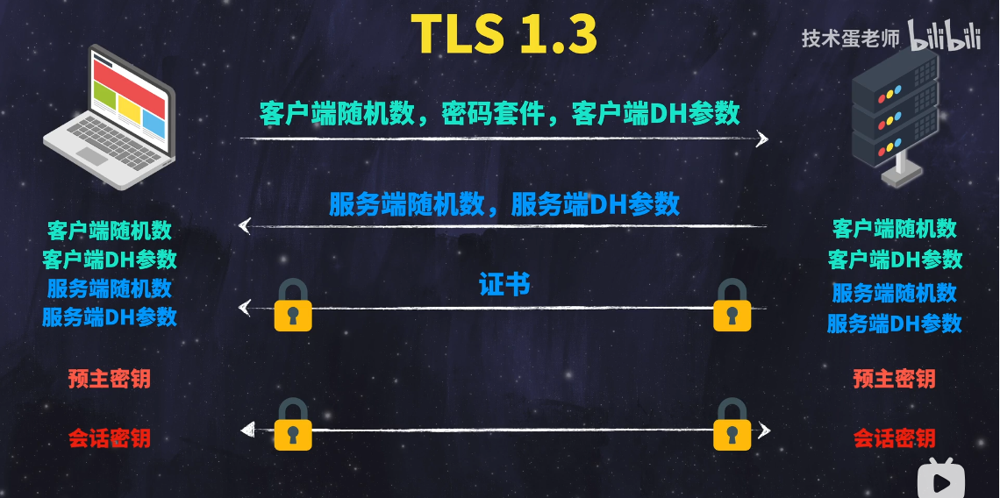

# TLS
> 目的： 密钥交换  , 请先学习:[TLS/1.2和TLS/1.3的核心区别 | HTTPS有哪些不安全因素](../../008.LESSONS/1026939694_u2-1-16.mp4)  结合 [HTTPS](./../003.HTTPS/README.md) 一起学习，更好理解

Transport Layer Security (TLS) 是一种广泛采用的安全性协议，旨在促进互联网通信的私密性和数据安全性。TLS 的主要用例是对 Web 应用和服务器之间的通信（例如，Web 浏览器加载网站）进行加密。TLS 还可以用于加密其他通信，如电子邮件、消息传递和 IP 语音 (VoIP) 等。

## 简单记录TLS1.3

+ 简单记录:
  - 预主密钥的生成原理： DH算法生成的（核心就是预主密钥的生成原理）: 
    1. 客户端服务端确定DH参数 P&G; 
    2. 客户端服务端生成随机数，套用DH公式，计算得到随机数；
    3. 客户端服务端交换随机数，再利用DH算法，就可以计算得到预主密钥

---

## 参考资料
+ [什么是传输层安全性（TLS）？ _ Cloudflare.pdf](./999.REFS/什么是传输层安全性（TLS）？%20_%20Cloudflare.pdf)