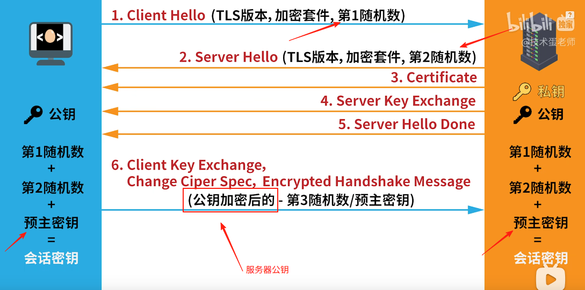

# HTTPSHTTPS = HTTP + SSL/TLS
> 先学习:[HTTPS](../../010.LESSONS/457483015_u1-1-16.mp4)

需要理解如下TLS握手流程:

+ 注意:
  - 随机数1： 客户端 -> 服务端
  - 随机数2： 服务端 -> 客户端
  - 随机数3： 也是预主密钥， 由客户端生成，使用公钥加密发送给服务端，服务端使用私钥解密，得到预主密钥。
  - 服务器公钥使用场景: 加密预主密钥
  - 会话密钥： 由随机数1 ， 随机数2 ， 预主密钥计算得来，后续使用会话密钥进行对称加密进行信息传输