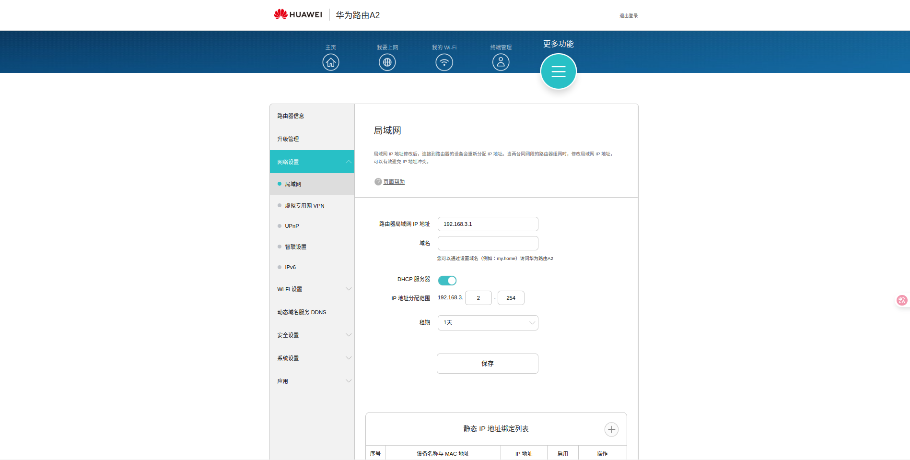
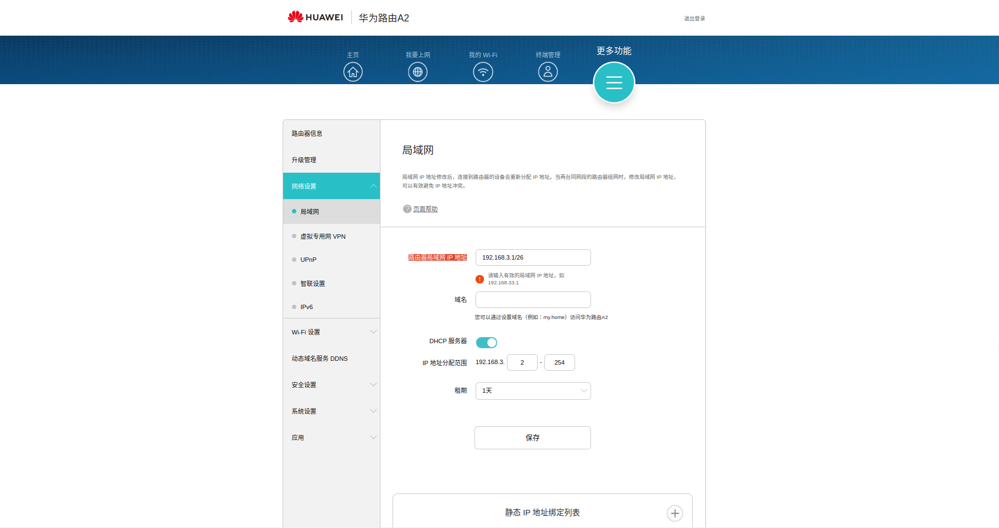
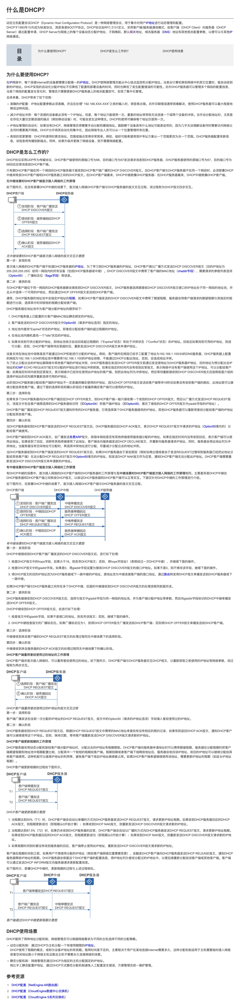

# 动态主机配置协议 DHCP（Dynamic Host Configuration Protocol，动态主机配置协议）
> 先学习:[DHCP运作原理和握手过程](../../010.LESSONS/457483015_u1-1-16.mp4)

+ 静态IPDHCP也可以分配静态IP & 动态IP
+ DHCP 分配出去的IP是有租期的
+ DHCP 工作流程
+ A2路由器WIFI支持的最大设备数量254下图中 路由器局域网 IP 地址	 无法修改
  - 
  - 

## 参考资料
- [DHCP配置](https://support.huawei.com/hedex/hdx.do?docid=EDOC1100087046&id=ZH-CN_CONCEPT_0176371515)
- [什么是DHCP？](https://info.support.huawei.com/info-finder/encyclopedia/zh/DHCP.html)
  + 