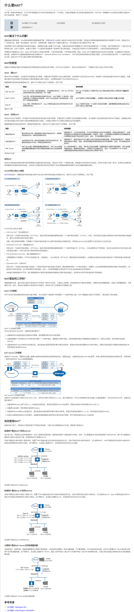

# NAT(Network Address Translation)
网络地址转换（英语：Network Address Translation，缩写：NAT），又称IP动态伪装（英语：IP Masquerade）[1]:176，是一种在IP封包通过路由器或防火墙时重写来源或目的IP地址或端口的技术。这种技术普遍应用于有多台主机，但只通过一个公有IP地址访问网际网路的私有网络中。

NAPT在进行地址转换的同时还进行端口转换，可以实现多个私网用户共同使用一个公网IP地址上网。

## 参考资料
+ [什么是NAT？](https://info.support.huawei.com/info-finder/encyclopedia/zh/NAT.html)