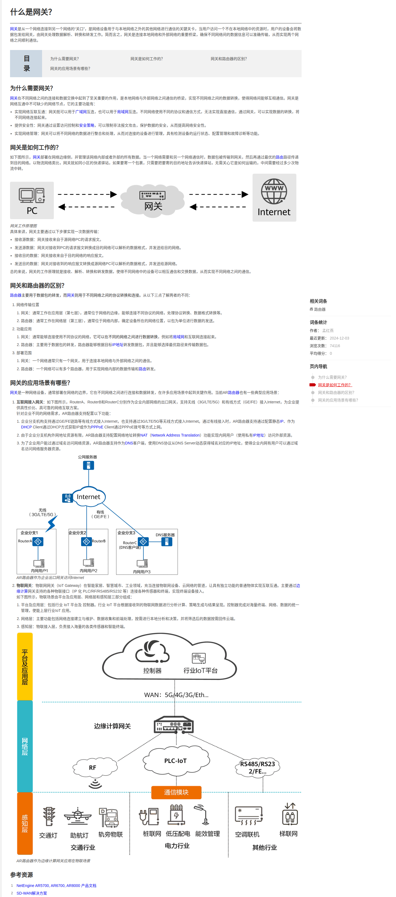

# Unix 网络
&nbsp;&nbsp;UNIX 网络

---

## 单播、组播、广播、任播
|名称|说明|地址|备注|疑问|
|-|-|-|-|-|
|单播|单播是指一种向单个目标地址传送数据的方式，也就是单独的一对一通讯方式。||||
|组播|组播是向一个组中发送数据包的方式。在组播中，数据包被发送到特定的IP地址，该IP地址同时也是该组中所有设备的组ID|1. IPv4： IPv4组播地址使用D类地址，其范围是：224.0.0.0～239.255.255.255   2.IPv6: 前缀：IPv6组播地址的前缀是FF00::/8（1111 1111）|1. 在路由器上设置路由协议，可以将一条路由信息通过组播发送给网络中所有的路由器，从而进行快速的路由更新|1. 组ID是什么|
|广播|广播是指一种向本地网络中所有设备发送数据的方式|在IP网络中，广播地址用IP地址“255.255.255.255”来表示，这个IP地址代表同一子网内所有的IP地址。|1. 局域网中发送ARP请求以查找MAC地址||
|任播|任播用于识别同一“服务”的多个设备中的最近者||||

- 单播 -> 组播 -> 广播，是通信数量不断增加的通信方式。当然，通信数量的增多，带来的是通信设备的资源消耗更大，整体网络环境的复杂度更高。

---
## 术语
### 1. MTU： 最大传输单元(Maximum Transmission Unit)
最大传输单元（Maximum Transmission Unit，MTU）用来通知对方所能接受数据服务单元的最大尺寸，说明发送方能够接受的有效载荷大小。 是包或帧的最大长度，一般以字节记。如果MTU过大，在碰到路由器时会被拒绝转发，因为它不能处理过大的包。如果太小，因为协议一定要在包(或帧)上加上包头，那实际传送的数据量就会过小，这样也划不来。大部分操作系统会提供给用户一个默认值，该值一般对用户是比较合适的

### 2. 任播（Anycast）
任播通过将相同IP地址分配到多个终端节点上, 利用BGP（边界网关协议（BGP））实现最佳路径选择。在网络地址和网络节点之间存在一对多的关系：每一个地址对应一群接收节点，但在任何给定时间，只有其中之一可以接收到发送端来的信息。使用案例: CDN

### 3. 网关

---
## 参考资料
+ 《UNIX 网络编程第三版 · 卷一》
+ [HUAWEI: Info-Finder 非常棒的网络知识来源](https://info.support.huawei.com/info-finder/vue/zh/enterprise/index)