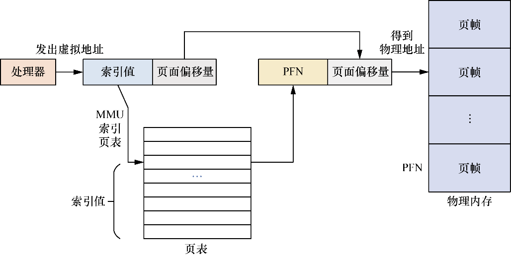

# 页表的创建和查询过程
> 阅读: [奔跑吧Linux内核（第2版）卷1：基础架构#1.1.9　页表的创建和查询过程](../006.BOOKs/Run%20Linux%20Kernel%20(2nd%20Edition)%20Volume%201:%20Infrastructure.epub)

程序执行所需要的内存往往大于实际物理内存，采用传统的动态分区方法会把整个程序交换到交换分区，这样费时费力，而且效率很低。后来出现了分页机制，分页机制引入了虚拟存储器（virtual memory）的概念，*它的核心思想是让程序中一部分不使用的内存可以交换到交换分区中*，而程序正在使用的内存继续保留在物理内存中。

在使能了分页机制的系统中，处理器直接寻址虚拟地址，这个地址不会直接发给内存控制器，而是先发送给MMU的硬件单元。MMU负责虚拟地址到物理地址的转换和翻译工作。

在虚拟地址空间里按照固定大小来分页，典型页面的粒度为4KB，现代处理器都支持大粒度的页面，如16KB、64KB甚至2MB的巨页（huge page）。而在物理内存中也会分成和虚拟地址空间中大小相同的块，这称为页帧（page frame）。程序可以在虚拟地址空间里任意分配虚拟内存，但只有当程序需要访问或修改虚拟内存时操作系统才会为其分配物理页面，这个过程叫作**请求调页（demand page）**或者**缺页异常**（page fault）。

虚拟地址VA[31:0]可以分成两部分：一部分是虚拟页面内的偏移量，以4KB页为例，VA[11:0]是虚拟页面内的偏移量；另一部分用来确定属于哪个页，我们称其为虚拟页帧号（Virtual Page Frame Number，VPN）。对于物理地址，也是类似的，PA[11:0]表示物理页帧的偏移量，剩余部分表示物理页帧号（Physical Frame Number，PFN）。MMU的工作内容就是把VPN转换成PFN。处理器通常使用一张表来存储VPN到PFN的映射关系，这个表称为页表（Page Table，PT）。页表中每一个表项称为页表项（Page Table Entry PTE）。若将整张页表存放在寄存器中，则会占用很多硬件资源，因此通常的做法是把页表放在主内存里，通过页表基地址寄存器（Translation Table Base Register，TTBR）来指向这种页表的起始地址

分页机制让每个进程都“感觉”自己拥有了全部的虚拟地址空间。为此，每个进程拥有了一套属于自己的页表，在进程切换时需要切换页表基地址。因此，每个进程拥有了一套属于自己的页表，在进程切换时需要切换页表基地址。
+ 二级页表设计原因: 对于上述的一级页表，每个进程需要为其分配4MB的连续物理内存来存储页表，这是不能接受的，因为这样太浪费内存了。多级页表可减少页表所占用的内存空间
  - 二级页表分成一级页表和二级页表，页表基地址寄存器指向一级页表的基地址，一级页表的页表项里存放了一个指针，指向二级页表的基地址。当处理器执行程序时它只需要把一级页表加载到内存中，并不需要把所有的二级页表都装载到内存中，而根据物理内存分配和映射情况逐步创建与分配二级页表

在现代处理器中，软件使用虚拟地址访问内存，而处理器的MMU负责把虚拟地址转换成物理地址。为了完成这个映射过程，软件和硬件要共同维护一个多级映射的页表。当处理器发现页表项无法映射到对应的物理地址时，会触发一个缺页异常，挂起出错的进程，操作系统需要处理这个缺页异常。

---

## 专业术语
+ TLB（Translation Lookaside Buffer，快表）