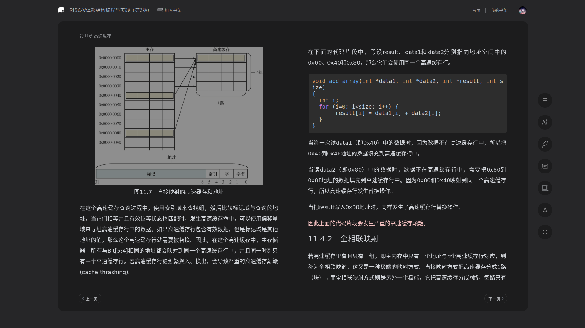
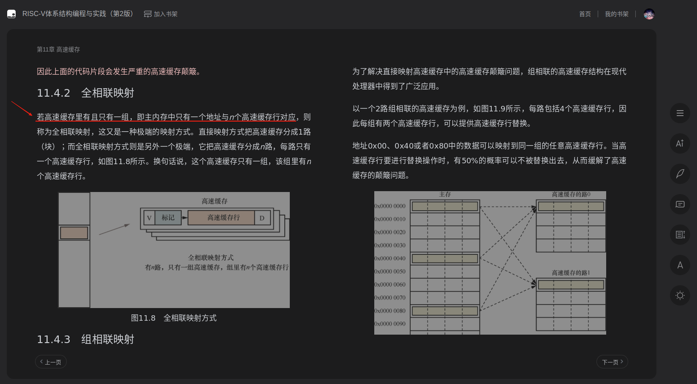
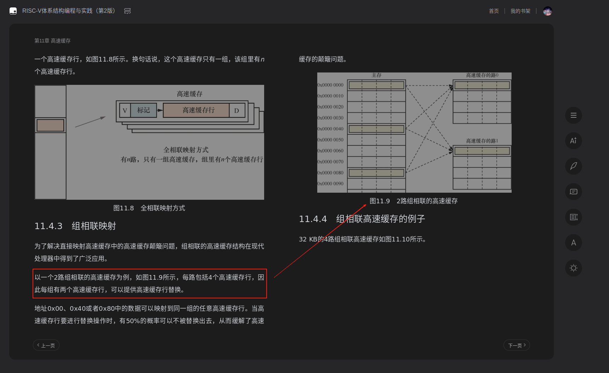
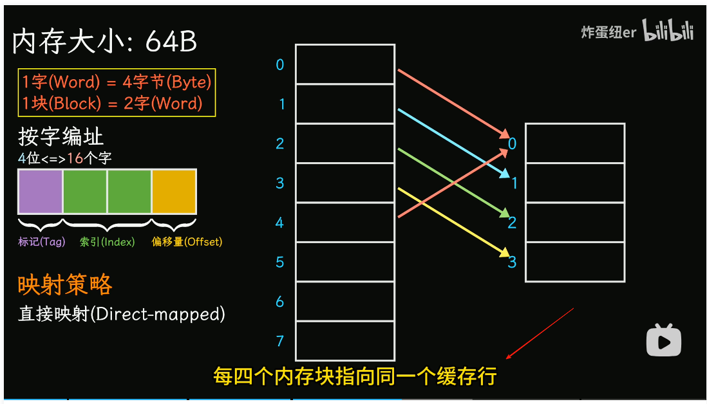

# 高速缓存工作方式
请阅读:[奔跑吧Linux内核（第2版）卷1：基础架构#1.1.5　高速缓存的工作方式](../006.BOOKs/Run%20Linux%20Kernel%20(2nd%20Edition)%20Volume%201:%20Infrastructure.epub) 

## 缓存行（Cache Line）解释：
缓存行 是 CPU 高速缓存中的最小数据传输单元。在 CPU 中，高速缓存是通过将内存中的数据块分割成一定大小的块进行存储的，这些块就是缓存行。


## 什么是高速缓存<sup>解决CPU访问速度和内存访问速度不一致问题</sup>
高速缓存（Cache）是一种存储器，它用于存储经常使用的数据或指令，以加速数据的访问速度。高速缓存的目的是减少处理器访问主存储器（如RAM）时的延迟，从而提高系统的整体性能。

## 如何理解文中提到的 组 路 缓存行 等名词
结合 [奔跑吧Linux内核（第2版）卷1：基础架构#1.1.5　高速缓存的工作方式](../006.BOOKs/Run%20Linux%20Kernel%20(2nd%20Edition)%20Volume%201:%20Infrastructure.epub)  章节内容，以及如下截图（均来自 [《RISC-V体系结构编程与实践（第2版）》<sup>笨叔·著</sup>](../006.BOOKs/RISC-V%20Architecture%20Programming%20and%20Practice.pdf)）：
- 
    + 从路和组的角度来看，这个高速缓存只有1路，每路里有4组，每组里只有一个高速缓存行——解释上图

可以发现：
- 路： 一个 “大方块” 就是一路
- 组： 一路里面包含多个组


  - 通过这张图，就更能明白 组 和 路 的关系了
  - N路，即表示 主内存中一个地址与N个高速缓存行对应。


---

TLB: 是一个用于存储虚拟地址到屋里地址转换的小缓存。


## 思考
### Linux上，如何查看高速缓存信息?
```shell
wei@Berries-Wang:~$ cat /sys/devices/system/cpu/cpu0/cache/index0/coherency_line_size
64  # 表示第一个核心的 L1 数据缓存行大小为 64 字节
```
---

## 需要知道什么
结合上述内容，请依次查看: [理解计算机物理内存，从位、字节到字，以及寻址的双重视角](./000.理解计算机Cache/1309897644-1-16.mp4)、[理解计算机Cache（一）：从块到缓存结构，以及逐步推出映射策略](./000.理解计算机Cache/1340460312-1-16.mp4)、[高观点下的C语言指针，指针就是地址吗？指针变量和类型？为什么指针会那么“难”](./000.理解计算机Cache/1373047358-1-192.mp4)、[理解计算机Cache（二）：缓存与内存的交互](./000.理解计算机Cache/1420393942-1-16.mp4),需要着重关注:
1. 什么是按字编址？什么是字节编址？
2. 直接映射
3. 全相联映射
4. 组相联映射 : 折衷处理
5. 地址分为 标记  索引 偏移量 , 分别代表什么意思
之后，就可以了解
6. 缓存与内存的交互
   - Cache的总容量 和 存储容量 的区别

### 注意
#### 错误1.
在  [理解计算机Cache（一）：从块到缓存结构，以及逐步推出映射策略](./000.理解计算机Cache/1340460312-1-16.mp4) 中有个错误，如下图: 其实是每两个内存块指向同一个缓存行
- 