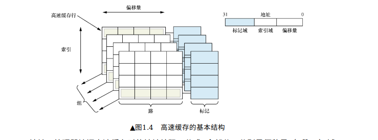

# 高速缓存工作方式
请阅读:[奔跑吧Linux内核（第2版）卷1：基础架构#1.1.5　高速缓存的工作方式](../006.BOOKs/Run%20Linux%20Kernel%20(2nd%20Edition)%20Volume%201:%20Infrastructure.epub) 

## 什么是高速缓存解决CPU访问速度和内存访问速度不一致问题
高速缓存（Cache）是一种存储器，它用于存储经常使用的数据或指令，以加速数据的访问速度。高速缓存的目的是减少处理器访问主存储器（如RAM）时的延迟，从而提高系统的整体性能。

## 如何理解文中提到的 组 路 缓存行 等名词
通过分析 [奔跑吧Linux内核（第2版）卷1：基础架构#1.1.5　高速缓存的工作方式](../006.BOOKs/Run%20Linux%20Kernel%20(2nd%20Edition)%20Volume%201:%20Infrastructure.epub)  章节内容，可以分析得到各个名词的概念(借助一下图更好理解):
- 
   + 路
   + 组
   + 

TLB: 是一个用于存储虚拟地址到屋里地址转换的小缓存。
