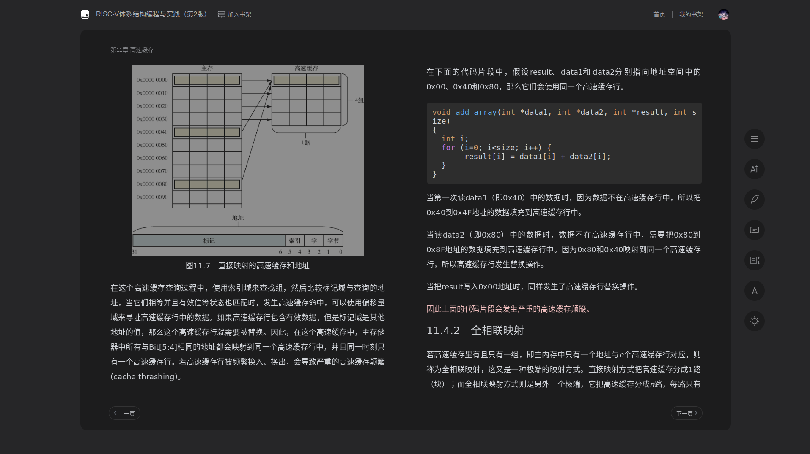
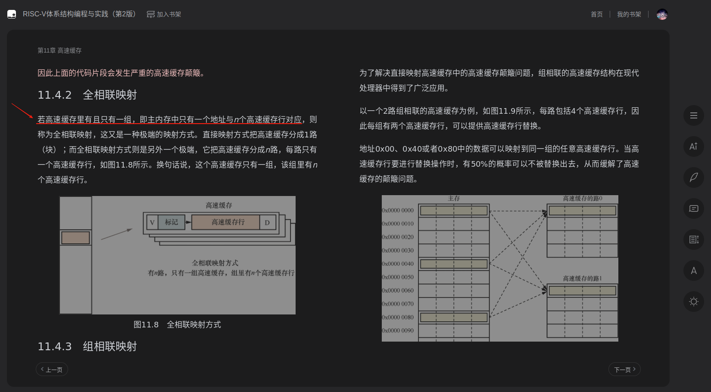
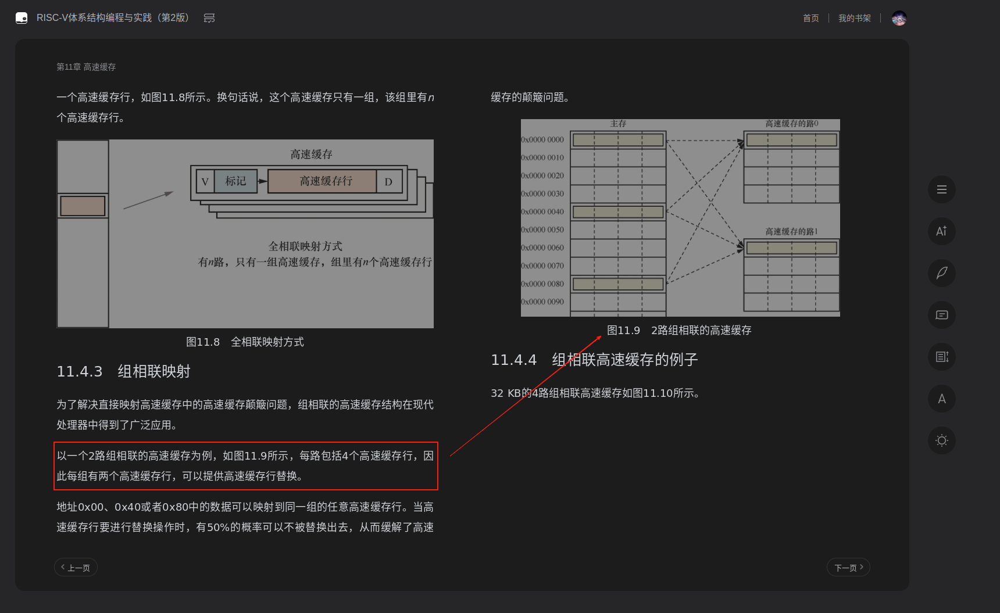

# 高速缓存工作方式
请阅读:[奔跑吧Linux内核（第2版）卷1：基础架构#1.1.5　高速缓存的工作方式](../006.BOOKs/Run%20Linux%20Kernel%20(2nd%20Edition)%20Volume%201:%20Infrastructure.epub) 

## 什么是高速缓存解决CPU访问速度和内存访问速度不一致问题
高速缓存（Cache）是一种存储器，它用于存储经常使用的数据或指令，以加速数据的访问速度。高速缓存的目的是减少处理器访问主存储器（如RAM）时的延迟，从而提高系统的整体性能。

## 如何理解文中提到的 组 路 缓存行 等名词
结合 [奔跑吧Linux内核（第2版）卷1：基础架构#1.1.5　高速缓存的工作方式](../006.BOOKs/Run%20Linux%20Kernel%20(2nd%20Edition)%20Volume%201:%20Infrastructure.epub)  章节内容，以及如下截图（均来自 [《RISC-V体系结构编程与实践（第2版）》笨叔·著](../006.BOOKs/RISC-V%20Architecture%20Programming%20and%20Practice.pdf)）：
- 
    + 从路和组的角度来看，这个高速缓存只有1路，每路里有4组，每组里只有一个高速缓存行——解释上图

可以发现：
- 路： 一个 “大方块” 就是一路
- 组： 一路里面包含多个组

  - 通过这张图，就更能明白 组 和 路 的关系了
  - N路，即表示 主内存中一个地址与N个高速缓存行对应。

---

TLB: 是一个用于存储虚拟地址到屋里地址转换的小缓存。

## 思考
### Linux上，如何查看高速缓存信息?
